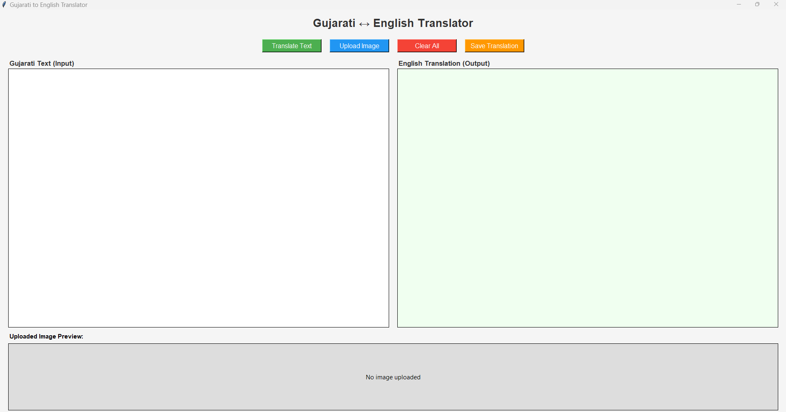
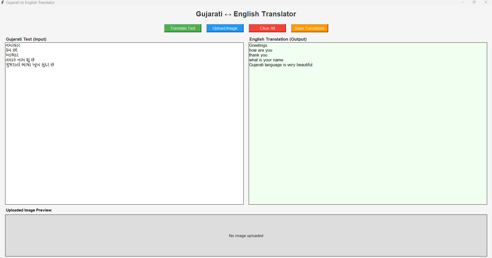
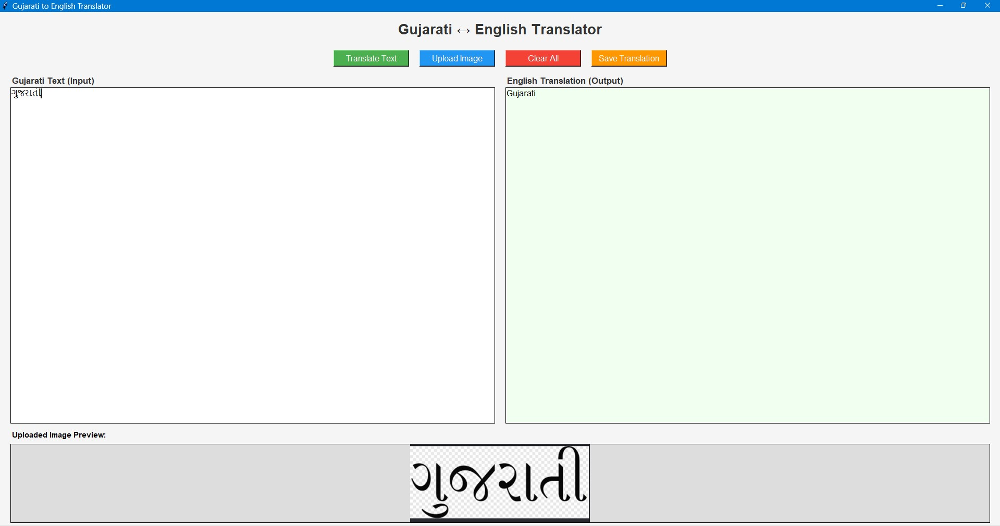

# Gujarati to English Translator

## Project Title
Gujarati to English Translation System with OCR Support

---

## Project Description
A desktop application that translates Gujarati text to English.
Supports two input modes:
1. Type Gujarati text directly and get instant translation
2. Upload an image containing Gujarati text — OCR extracts
   the text automatically and translates it

Both Gujarati input and English output are shown side by side.

---

## Technologies Used
| Technology | Version | Purpose |
|---|---|---|
| Python | 3.11 | Core programming language |
| Tkinter | Built-in | Desktop GUI (Frontend) |
| googletrans | 4.0.0rc1 | Google Translate API (Backend) |
| Tesseract OCR | 5.5.0 | OCR engine (Backend) |
| pytesseract | Latest | Python bridge to Tesseract |
| Pillow | Latest | Image processing |

---

## Project Structure
gujarati_translator/
├── translator.py       - Main source code (Frontend + Backend)
├── config.py           - Configuration settings
├── requirements.txt    - Python dependencies
├── README.md           - Project documentation
└── screenshots/        - Output screenshots
    ├── gui_empty.png
    ├── translation.png
    └── ocr_result.png

---

## Backend Setup

### What the backend does
- Connects to Google Translate API for translation
- Uses Tesseract OCR to extract Gujarati text from images
- Handles file saving with UTF-8 encoding

### Step 1 - Install Python 3.11
Download: https://www.python.org/downloads/release/python-3119/
Tick "Add Python to PATH" during installation

### Step 2 - Install Tesseract OCR Engine
Download: https://github.com/UB-Mannheim/tesseract/wiki
File: tesseract-ocr-w64-setup-5.x.x.exe

During installation:
- Keep default path: C:\Program Files\Tesseract-OCR\
- Expand "Additional language data (download)"
- Tick "Gujarati" checkbox
- Click Install

Verify installation:
& "C:\Program Files\Tesseract-OCR\tesseract.exe" --list-langs
Expected output: eng, guj, osd

### Step 3 - Install Python dependencies
py -3.11 -m pip install -r requirements.txt

---

## Frontend Setup

### What the frontend does
- Tkinter window with two text panels side by side
- Left panel: Gujarati text input
- Right panel: English translation output
- Buttons: Translate, Upload Image, Clear, Save Translation
- Image preview area for uploaded images
- Status bar showing current operation

### No separate setup needed
Frontend runs automatically when you run translator.py

---

## Installation Commands
# Install all dependencies
py -3.11 -m pip install -r requirements.txt

# Or install individually
py -3.11 -m pip install googletrans==4.0.0rc1
py -3.11 -m pip install pytesseract
py -3.11 -m pip install Pillow

---

## Run Commands
# Navigate to project folder
cd C:\Users\ASUS\gujarati_translator

# Run the application
py -3.11 translator.py

---

## How it works

### Text Translation Flow
User types Gujarati text in left box
        ↓
Clicks Translate Text button
        ↓
googletrans API sends text to Google (src=gu, dest=en)
        ↓
English translation received
        ↓
Shown in right panel

### Image OCR + Translation Flow
User clicks Upload Image
        ↓
File picker opens - user selects image
        ↓
Pillow opens the image
        ↓
Tesseract OCR extracts Gujarati text (lang=guj)
        ↓
Extracted text shown in left panel
        ↓
googletrans translates to English
        ↓
Translation shown in right panel

---

## Configuration
All settings are stored in config.py:
- TESSERACT_PATH: Path to Tesseract executable
- SOURCE_LANGUAGE: 'gu' (Gujarati)
- TARGET_LANGUAGE: 'en' (English)
- OCR_LANGUAGE: 'guj' (Gujarati for Tesseract)
- WINDOW_SIZE: '900x700'
- FONT settings and COLOR settings

---

## Output Screenshots

### Empty GUI

### Text Translation

### Image OCR Result

---

## Features
- Type or paste Gujarati text and translate instantly
- Upload PNG, JPG, JPEG, BMP images
- OCR automatically extracts Gujarati text from images
- Side by side display of both languages
- Save translation to .txt file with UTF-8 encoding
- Real time status bar updates
- Image preview of uploaded file

---

## End to End Flow
User Input (Text or Image)
        ↓
Frontend (Tkinter GUI)
        ↓
Backend Processing
(Tesseract OCR / Google Translate API)
        ↓
Result displayed in GUI
        ↓
Optional: Save to file